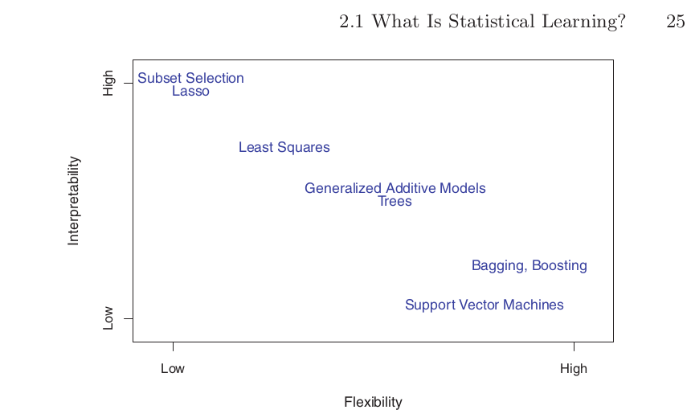
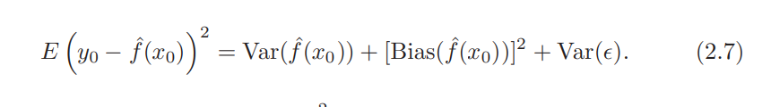
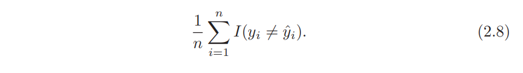
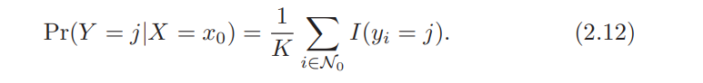

# Supervised Learning
- Supervised learning algorithms are trained using labels examples such as an input where the desired output is known.
- For example, a piece of equipment could have data points labeled either “F” (failed) or “R” (runs).
- The learning algorithm receives a set of inputs along with the corresponding correct outputs, and the algorithm learns by comparing its actual output with correct outputs to find errors.
- It then modifies the model accordingly.
- For example, it can anticipate when credit card transactions are likely to be fraudulent or which insurance customer is likely to file a claim.

## What is Machine Learning?
- Machine learning is a method of data analysis that automates analytical model building.
- Using algorithms that iteratively learn from data, machine learning allows computers to find hidden insights without being explicitly programmed where to look.

## Unsupervised learning
- Unsupervised learning is used against data that has no historical labels.
- The system is not told the "right answer." The algorithm must figure out what is being shown.
- The goal is to explore the data and find some structure within.

## Training Data
- data is often split into three sets:
    - Training data: 
        - Used to train model parameters
    - Validation Data:
        - Used to determine what model hyperparameters to adjust
    - Test data
        - Used to get some final performance metric
- true performance is the final test on unseen test data
- We will use train / test split in this course
- Students will have the option to go back and adjust parameters
- A final split can be done at the end of the course to get 3 data sets

2.1 What Is Statistical Learning?
More generally, suppose that we observe a quantitative response Y and p different predictors, X1 , X2 , . . . , Xp . We assume that there is some relationship between Y and X = (X1 , X2 , . . . , Xp ), which can be written in the very general form:
```
Y = f (X) + E.
```

In essence, statistical learning refers to a set of approaches for estimating f: In this chapter we outline some of the key theoretical concepts that arise in estimating f, as well as tools for evaluating the estimates obtained.


## Why Estimate f ?

There are two main reasons that we may wish to estimate f : prediction and inference. We discuss each in turn.

### Prediction
In many situations, a set of inputs X are readily available, but the output Y cannot be easily obtained. In this setting, since the error term averages to zero, we can predict Y using
```
    Ŷ = fˆ(X)
```

#### Example
More generally, suppose that we observe a quantitative response Y and p different predictors, X1 , X2 , . . . , Xp . We assume that there is some relationship between Y and X = (X1 , X2 , . . . , Xp ), which can be written in the very general form Y = f (X) + E.
- The accuracy of Ŷ as a prediction for Y depends on two quantities, which we will call the **reducible error** and the **irreducible error**.
- In general f^ will not be a perfect estimator for f and this inaccuracy will produce some error, known as **reducible error**. As we have the potentital to reduce inaccuracy of f by using the most appropriate statistical learning technique to estimate F.
- However, even if it were possible to form a perfect estimate for f, so that our estimated response took the form Ŷ = f (X), our prediction would still have some error in it!
- This is because Y is also a function of + E. 
- Therefore, variability associated with E also affects the accuracy of our predictions. This is known as the **irreducible error**, because no matter how well we estimate f:, we cannot reduce the error introduced by E.
- Consider a given estimate fˆ and a set of predictors X, which yields the prediction Ŷ = fˆ(X). Assume for a moment that both fˆ and X are fixed.
```
~(Y − Ŷ )2 = ~[f (X) + E − fˆ(X)]2
= [f (X) − fˆ(X)]2 + Var(E)
```
- where ~(Y − Ŷ) represents the average, or expected value, of the squared expected difference between the predicted and actual value of Y , and Var(E) repre- value sents the variance associated with the error term E.
- It is important to keep in mind that the **irreducible error** will always provide an upper bound on the accuracy of our prediction for Y. This bound is almost always unknown in practice.

### Inference 
- We are often interested in understanding the way that Y is affected as X1 , . . . , Xp change.
- In this setting, one may be interested in answering the following questions:
    - Which predictors are associated with the response? It is often the case that only a small fraction of the available predictors are substantially associated with Y . Identifying the few important predictors among a large set of possible variables can be extremely useful, depending on the application.
    - What is the relationship between the response and each predictor? Some predictors may have a positive relationship with Y , in the sense that increasing the predictor is associated with increasing values of Y . Other predictors may have the opposite relationship. Depending on the complexity of f , the relationship between the response and a given predictor may also depend on the values of the other predictors.
    - Can the relationship between Y and each predictor be adequately summarized using a linear equation, or is the relationship more complicated? Historically, most methods for estimating f have taken a linear form. In some situations, such an assumption is reasonable or even desirable. But often the true relationship is more complicated, in which case a linear model may not provide an accurate representation of the relationship between the input and output variables.
- Depending on whether our ultimate goal is prediction, inference, or a combination of the two, different methods for estimating f may be appropriate.
- For example, linear models allow for relatively simple and interpretable inference, but may not yield as accurate predictions as some other approaches
- In contrast, some of the highly non-linear approaches that we discuss in the later chapters of this book can potentially provide quite accurate predictions for Y , but this comes at the expense of a less interpretable model for which inference is more challenging.

## How Do We Estimate f ?
- Throughout this book, we explore many linear and non-linear approaches for estimating f . However, these methods generally share certain characteristics.
- We will always assume that we have observed a set of n different data points.
- For example in Figure 2.2 we observed n = 30 data points. These observations are called the **training data** because we will use these training data observations to train, or teach, our method how to estimate f .
- Our goal is to apply a statistical learning method to the training data in order to estimate the unknown function f . In other words, we want to find a function fˆ such that Y ≈ fˆ(X) for any observation (X, Y ).
- Broadly speaking, most statistical learning methods for this task can be characterized as either parametric or non-parametric.

### Parametic Methods 
- Parametric methods involve a two-step modelbased approach.
1. First, we make an assumption about the functional form, or shape, of f . For example, one very simple assumption is that f is linear in X:
```
    f (X) = β0 + β1 X1 + β2 X2 + . . . + βp Xp .
```
This is a linear model, which will be discussed extensively in Chap- ter 3. Once we have assumed that f is linear, the problem of estimating f is greatly simplified. Instead of having to estimate an entirely arbitrary p-dimensional function f (X), one only needs to estimate the p + 1 coefficients β0 , β1 , . . . , βp .
2. After a model has been selected, we need a procedure that uses the training data to fit or train the model. In the case of the linear model fit (2.4), we need to estimate the parameters β0 , β1 , . . . , βp . That is, we want to find values of these parameters such that:
```
Y ≈ β0 + β1X1 + β2X2 + . . . + βpXp .
```
The most common approach to fitting the model (2.4) is referred to as (ordinary) least squares, which we discuss in Chapter 3. How least squares ever, least squares is one of many possible ways way to fit the linear model. In Chapter 6, we discuss other approaches for estimating the parameters in (2.4).

- The model-based approach just described is referred to as parametric; it reduces the problem of estimating f down to one of estimating a set of parameters.
- Figure 2.4 shows an example of the parametric approach applied to theIncome data from Figure 2.3. We have fit a linear model of the form

```
income ≈ β0 + β1 × education + β2 × seniority.
```

### Non-parmetric Methods
- Non-parametric methods do not make explicit assumptions about the functional form of f . Instead they seek an estimate of f that gets as close to the data points as possible without being too rough or wiggly.
- Any parametric approach brings with it the possibility that the functional form used to
estimate f is very different from the true f , in which case the resulting model will not fit the data well.
- But non-parametric approaches do suffer from a major disadvantage: since they do not reduce the problem of estimating f to a small number of parameters, a very large number of observations (far more than is typically needed for a parametric approach) is required in order to obtain an accurate estimate for f .
- An example of a non-parametric approach to fitting the Income data is shown in Figure 2.5. A thin-plate spline is used to estimate f . This approach does not impose any prespecified model on f .
- It instead attempts to produce an estimate for f that is as close as possible to the observed data, subject to the fit that is, the yellow surface in Figure 2.5—being smooth.
- In order to fit the data the analyst must select the soothness.
- The resulting estimate fits the observed data perfectly! However, the spline fit shown in Figure 2.6 is far more variable than the true function f , from Figure 2.3. This is an example of overfitting the data, which we discussed previously.
- overfitting: in general, fitting a more flexible model requires estimating a
greater number of parameters. These more complex models can lead to a phenomenon known as **overfitting** the data, which essentially means they follow the errors, or noise, too closely.

## The Trade-Off Between Prediction Accuracy and Model Interpretability
- Of the many methods that we examine in this book, some are less flexible, or more restrictive, in the sense that they can produce just a relatively small range of shapes to estimate f.
- For example, linear regression is a relatively inflexible approach, because it can only generate linear functions such as the lines shown in Figure 2.1 or the plane shown in Figure 2.3.



FIGURE 2.7. A representation of the tradeoff between flexibility and interpretability, using different statistical learning methods. In general, as the flexibility of a method increases, its interpretability decreases.

- Other methods, such as the thin plate splines shown in Figures 2.5 and 2.6, are considerably more flexible because they can generate a much wider range of possible shapes to estimate f.
- There are several reasons that we might prefer a more restrictive model. If we are mainly interested in inference, then restrictive models are much more **interpretable**.
- For instance, when inference is the goal, the linear model may be a good choice since it will be quite easy to understand the relationship between Y and X1, X2,...,Xp.
- In contrast, very flexible approaches, such as the splines discussed in Chapter 7 and displayed in Figures 2.5 and 2.6, and the boosting methods discussed in Chapter 8, can lead to such complicated estimates of f that it is difficult to understand how any individual predictor is associated with the response.


## Supervised Versus Unsupervised Learning
- Most statistical learning problems fall into one of two categories: **supervised** 
or **unsupervised**.
- The examples that we have discussed so far in this chapter all fall into the supervised learning domain. For each observation of the predictor measurement(s) Xi, i = 1,...,n there is an associated response measurement Yi.
- We wish to fit a model that relates the response to the predictors, with the aim of accurately predicting the response for future observations (prediction) or better understanding the relationship between the response and the predictors (inference)
- Many classical statistical learning methods such as linear regression and logistic regression (Chapter 4), as logistic well as more modern approaches such as GAM, boosting, and support vector machines, operate in the supervised learning domain.
- In contrast, **unsupervised** learning describes the somewhat more challenging situation in which for every observation i = 1,...,n, we observe a vector of measurements Xi but no associated response Yi. 
- In this setting, we are in some sense working blind; the situation is referred to as unsupervised because we lack a response variable that can supervise our analysis.
-  One statistical learning tool that we may use in this setting is cluster analysis, or clustering. The goal of cluster analysis cluster is to ascertain, on the basis of x1,...,xn, whether the observations fall into relatively distinct groups. 
- However, sometimes the question of whether an analysis should be considered supervised or unsupervised is less clear-cut. For instance, suppose that we have a set of n observations. For m of the observations, where m<n, we have both predictor measurements and a response measurement.
- For the remaining n − m observations, we have predictor measurements but no response measurement. Such a scenario can arise if the predictors can be measured relatively cheaply but the corresponding responses are much more expensive to collect.

## Regression Versus Classification Problems
- Variables can be characterized as either **quantitative** or **qualitative** (also known as **categorical**).
- We tend to refer to problems with a **quantitative** response as **regression** problems, while those involving a **qualitative** response are often referred to as **classification** problems.
- **Least squares linear regression** (Chapter 3) is used with a quantitative response, whereas **logistic regression** (Chapter 4) is typically used with a qualitative (two-class, or binary) response.
- Least squares linear regression (Chapter 3) is used with a quantitative response, whereas logistic
regression (Chapter 4) is typically used with a qualitative (two-class, or binary) response.
- Some statistical methods, such as K-nearest neighbors (Chapters 2 and 4) and boosting (Chapter 8), can be used in the case of either quantitative or qualitative responses
- We tend to select statistical learning methods on the basis of whether the response is quantitative or qualitative; i.e. we might use linear regression when quantitative and logistic regression when qualitative. 
- Most of the statistical learning methods discussed in this book can be applied regardless of the predictor variable type, provided that any qualitative predictors are properly coded before the analysis is performed. This is discussed in Chapter 3.

## Assessing Model Accuracy
- Why is it necessary to introduce so many different statistical learning approaches, rather than just a single best method? There is no free lunch in statistics: no one method dominates all others over all possible data sets
- Selecting the best approach can be one of the most challenging parts of performing statistical learning in
practice

### Measuring the Quality of Fit
- In order to evaluate the performance of a statistical learning method on a given data set, we need some way to measure how well its predictions actually match the observed data. 
-  In the regression setting, the most commonly-used measure is the mean squared error (MSE), given by
```
          n
MSE = 1/n E (yi − ˆf(xi))2
         i=1

fig 2.5
```
- where ˆf(xi) is the prediction that ˆf gives for the ith observation
- The MSE will be **small** if the predicted responses are very close to the true responses, and will be **large** if for some of the observations, the predicted and true responses differ substantially
- The MSE in (2.5) is computed using the training data that was used to fit the model, and so should more accurately be referred to as the **training MSE**. 
- But in general, we do not really care how well the method works training on the training data. Rather, we are interested in the accuracy of the predictions that we obtain when we apply our method to previously unseen
test data.
- To state it more mathematically, suppose that we fit our statistical learning method on our training observations {(x1, y1),(x2, y2),...,(xn, yn)}, and we obtain the estimate ˆf. We can then compute ˆf(x1), ˆf(x2),..., ˆf(xn).
- If these are approximately equal to y1, y2,...,yn, then the training MSE given by (2.5) is small. However, we are really not interested in whether ˆf(xi) ≈ yi; instead, we want to know whether ˆf(x0) is approximately equal
to y0, where (x0, y0) is a previously unseen test observation not used to train the statistical learning method.
- We want to choose the method that gives the lowest test MSE, as opposed to the lowest training MSE. In other words, if we had a large number of test observations, we could compute:
```
Ave( ˆf(x0) − y0)^2

fig 2.6
```
- The average squared prediction error for these test observations (x0, y0). We’d like to select the model for which the average of this quantity—the test MSE—is as small as possible.
-  How can we go about trying to select a method that minimizes the test MSE? In some settings, we may have a test data set available—that is, we may have access to a set of observations that were not used to train the statistical learning method.
- But what if no test observations are available? In that case, one might imagine simply selecting a statistical learning method that minimizes the training MSE
- This seems like it might be a sensible approach, since the training MSE and the test MSE appear to be closely related.
- Unfortunately, there is a fundamental problem with this strategy: there is no guarantee that the method with the lowest training MSE will also have the lowest test MSE. 
- n to the right-hand panel of Figure 2.9. The grey curve displays the average training MSE as a function of flexibility, or more formally the degrees of freedom, for a number of smoothing splines. 
- Throughout this book, we discuss a variety of approaches that can be used in practice to estimate this minimum
point. One important method is **cross-validation** (Chapter 5), which is a method for estimating test MSE using the training data. 

### The Bias-Variance Trade-Of
- The U-shape observed in the test MSE curves (Figures 2.9–2.11) turns out to be the result of two competing properties of statistical learning methods.
- Though the mathematical proof is beyond the scope of this book, it is possible to show that the expected test MSE, for a given value x0, can always be decomposed into the sum of three fundamental quantities: thevariance of ˆf(x0), the squared bias of ˆf(x0) and the variance of the error variance bias terms. That is,

- Here the notation ```E(y0 − ˆf(x0))2``` defines the expected test MSE, and refers to the average test MSE that we would obtain if we repeatedly estimated f using a large number of training sets, and tested each at x0.
- Equation 2.7 tells us that in order to minimize the expected test error, we need to select a statistical learning method that simultaneously achieves **low variance** and **low bias**.
- Note that variance is inherently a nonnegative quantity, and squared bias is also nonnegative. Hence, we see that the expected test MSE can never lie below Var(), the irreducible error from (2.3).
- What do we mean by the variance and bias of a statistical learning method? Variance refers to the amount by which ˆf would change if we estimated it using a different training data set.
- What do we mean by the variance and bias of a statistical learning method?
    - **Variance** refers to the amount by which ˆf would change if we estimated it using a different training data set. Since the training data are used to fit the statistical learning method, different training data sets will result in a different ˆf. 
    - On the other hand, bias refers to the error that is introduced by approximating a real-life problem, which may be extremely complicated, by a much simpler model.
- As a general rule, as we use more flexible methods, the variance will increase and the bias will decrease.
- The relative rate of change of these two quantities determines whether the test MSE increases or decreases. As we increase the flexibility of a class of methods, the bias tends to initially decrease faster than the variance increases.
- Good test set performance of a statistical learning method requires low variance as well as low squared bias.
- This is referred to as a trade-off trade-off because it is easy to obtain a method with extremely low bias but
high variance (for instance, by drawing a curve that passes through every single training observation) or a method with very low variance but high bias (by fitting a horizontal line to the data).
- This is referred to as a trade-off trade-off because it is easy to obtain a method with extremely low bias but
high variance (for instance, by drawing a curve that passes through every single training observation) or a method with very low variance but high bias (by fitting a horizontal line to the data).
- In a real-life situation in which f is unobserved, it is generally not possible to explicitly compute the test MSE, bias, or variance for a statistical learning method.

### The Classification Setting
- Suppose that we seek to estimate f on the basis of training observations ```{(x1, y1),...,(xn, yn)}```, where now ```y1,...,yn``` are qualitative. 
-  The most common approach for quantifying the accuracy of our estimate ˆf is the **training error rate**, the proportion of mistakes that are made if we apply our estimate ˆf to the training observations:

- Here is the predicted class label for the ith observation using ˆf. And I(yi != ˆyi) is an indicator variable that equals 1 if yi != ˆyi and zero if yi == ˆyi.  
- The test error rate associated with a set of test observations of the form test error (x0, y0) is given by:
    - ```Ave (I(y0 != ˆy0))```
- where ˆy0 is the predicted class label that results from applying the classifier to the test observation with predictor x0. A good classifier is one for which the test error (2.9) is smallest.

#### The Bayes Classifier
- It is possible to show (though the proof is outside of the scope of this book) that the test error rate given in (2.9) is minimized, on average, by a very simple classifier that assigns each observation to the most likely class,
given its predictor values. 
- In other words, we should simply assign a test observation with predictor vector x0 to the class j for which
```PR(Y = j | X = x0)```
- Is the largest
- Note that (2.10) is a conditional probability: it is the probability conditional that Y = j, given the observed predictor vector x0.
-  In a two-class problem where there are only two possible response values, say class 1 or class 2, the Bayes classifier corresponds to predicting class one if ```Pr(Y = 1|X = x0) > 0.5```, and class two otherwise.
- The Bayes classifier produces the lowest possible test error rate, called the Bayes error rate.
- Since the Bayes classifier will always choose the class for which (2.10) is largest, the error rate at X = x0 will be ```1 - MAXj Pr(Y=j | X = x0)``` In general, the overall Bayes error rate is given by:
```
1 − E ( MAXj Pr(Y = j|X))

```
- where the expectation averages the probability over all possible values of X. For our simulated data, the Bayes error rate is 0.1304. It is greater than zero, because the classes overlap in the true population so maxj Pr(Y =
j|X = x0) < 1 for some values of x0. 

#### K-Nearest Neighbors
- In theory we would always like to predict qualitative responses using the Bayes classifier. But for real data, we do not know the conditional distribution of Y given X, and so computing the Bayes classifier is impossible.
- Many approaches attempt to estimate the conditional distribution of Y given X, and then classify a given observation to the class with highest estimated probability.
- Given a positive integer K and a test observation x0, the KNN classifier first identifies the K points in the training data that are closest to x0, represented by n0.
- It then estimates the conditional probability for class j as the fraction of points in N0 whose response values equal j:

- Finally, KNN applies Bayes rule and classifies the test observation x0 to the class with the largest probability.
- Despite the fact that it is a very simple approach, KNN can often produce classifiers that are surprisingly close to the optimal Bayes classifier.
- The choice of K has a drastic effect on the KNN classifier obtained. Figure 2.16 displays two KNN fits to the simulated data from Figure 2.13, using K = 1 and K = 100.
- On this simulated data set, neither K = 1 nor K = 100 give good predictions: they have test error rates of 0.1695 and 0.1925, respectively.
- With K = 1, the KNN training error rate is 0, but the test error rate may be quite high. In general, as we use more flexible classification methods, the training error rate will decline but the test error rate may not.

## Model Evaluation

### Classification Error Metrics
- classifcation metrics we need to understand is:
    - Accuracy: 
        - number of correct predictions / total predictions
        - not a good choice which unbalanced classes: if we had 99 dog pics and 1 cat pic, model would always say we got 99% accuracy
    - Recall: 
        - ability of a model to find all the relevant cases within a dataset
        - The precise definition of recall is the number of (true positives / (the number of true positives + number of false negatives))
    - Precision:
        - ability of a classification model to identify only the relevant data points.
        - Precision is defined as:
            - (true positives / (true positives + false positives)) 
    - Recall and Precision:
        - often a trade-off between the two
        - while recall expresses the ability to find all relevant instances in a dataset, precision expresses the proportion of the data points our model says was relevant actually were relevant.
    - F1-Score
        - in cases where you want to find optimal blend between recall and precision
        - is the harmonic mean of precision and recall taking both metrics into account in the following equation:
            - F1 = 2 * ((precision * recall)/(precision + recall))
        - uses harmonic mean instead of simple average because it punishes extreme values between precision and recall
        - 
- Two outcomes of evalution, correct or incorrect
- expands where you have multiple classes
- See soltion matrix: 
    - https://en.wikipedia.org/wiki/Confusion_matrix#Table_of_confusion

### Regression Error Metrics 
- We need metrics for continuous values
- most comoon:                  n
    - Mean absolute error: 1/n E  | yi - y^i |
                                i=1
                              n  
    - Mean square error: 1/n E  | (yi - y^i )**2
                              i=1
    
    - larger errors are noted more than with MAE, making MSE more popular

    - Root mean square Error: take the square root of the MSE output 
    - compare your error metric to the average value of the label in your data set to try to get an intuition of its overall performance 
    - Domain knowledge also plays an important role here

### Install scikit learn 

```
conda install scikit-learn
```

### Choosing the right estimator: 
https://scikit-learn.org/stable/tutorial/machine_learning_map/index.html