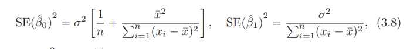

# Linear Regression

## Simple Linear Regression
-Simple linear regression lives up to its name: it is a very straightforward simple linear approach for predicting a quantitative response Y on the basis of a single predictor variable X. 
- It assumes that there is approximately a linear relationship between X and Y . Mathematically, we can write this linear relationship as:
$$ Y ≈ β0 + β1X $$
- Y approximately models β0 + β1X
- β0 and β1 are two unknown constants that represent the intercept and slope terms in the linear model. Together, β0 and β1 are intercept known as the model coefficients or parameters. Once we have used our training data to produce estimates βˆ0 and βˆ1 for the model coefficients, we can predict future sales on the basis of a particular value of TV advertising by computing
$$ yˆ = βˆ0 + βˆ1x $$
- approx y equals approc b0 plus approv B1x 

### Estimating the Coefficients
- In practice, β0 and β1 are **unknown**. 
- In practice, β0 and β1 are unknown. So before we can use (3.1) to make predictions, we must use data to estimate the coefficients.Let
$$ (x1, y1), (x2, y2),..., (xn, yn) $$ 
-represent n observation pairs, each of which consists of a measurement of X and a measurement of Y.
- Our goal is to obtain coefficient estimates βˆ0 and βˆ1 such that the linear model (3.1) fits the available data well—that is, so that 
$$ yi ≈ βˆ0 + βˆ1 Xi for i = 1,...,n. $$
- In other words, we want to find an intercept βˆ0 and a slope βˆ1 such that the resulting line is as close as possible to the n = 200 data points. 
- There are a number of ways of measuring closeness. However, by far the most common approach involves minimizing the **least squares** criterion, and we take that approach in this chapter.
- Let ˆyi = βˆ0 + βˆ1 Xi be the prediction for Y based on the ith value of X.
- Then ei = yi − yˆi represents the ith residual—this is the difference between residual the ith observed response value and the ith response value that is predicted by our linear model
- We define the residual sum of squares (RSS)
$$ RSS = e1^2 + e2^2 + ··· + en^2 $$
- equivalently as 
$$ RSS = (y1 −βˆ0−βˆ1 X1)^2 + (y2 −βˆ0−βˆ1 X2)^2 +...+ (yn−βˆ0−βˆ1xn)^2 $$ 
- The least squares approach chooses βˆ0 and βˆ1 to minimize the RSS. Using some calculus, one can show that the minimizers are

### Assessing the Accuracy of the Coefficient Estimates

- The error term is a catch-all for what we miss with this simple model: the true relationship is probably not linear, there may be other variables that cause variation in Y , and there may be measurement error.
-  The analogy between linear regression and estimation of the mean of a random variable is an apt one based on the concept of bias. 
- If we use the bias sample mean ˆμ to estimate μ, this estimate is unbiased, in the sense that on average, we expect ˆμ to equal μ. 
- What exactly does this mean? It means that on the basis of one particular set of observations y1,...,yn, ˆμ might overestimate μ, and on the basis of another set of observations, ˆμ might underestimate μ. 
- But if we could average a huge number of estimates of μ obtained from a huge number of sets of observations, then this average would exactly equal μ - The property of unbiasedness holds for the least squares coefficient estimates given by (3.4) as well: if we estimate β0 and β1 on the basis of a particular data set, then our estimates won’t be exactly equal to β0 and β1. But if we could average the estimates obtained over a huge number of data sets, then the average of these estimates would be spot on!
- A natural question is as follows: how accurate is the sample mean ˆμ as an estimate of μ?
- How far off will that single estimate of ˆμ be? In general, we answer this question by computing the standard error of ˆμ, written as SE(ˆμ).
$$ Var(ˆμ) = SE(ˆμ)^2 = σ2 / n $$ 
- where σ is the standard deviation of each of the realizations yi of Y
- Roughly speaking, the standard error tells us the average amount that this estimate ˆμ differs from the actual value of μ. Equation 3.7 also tells us how this deviation shrinks  ith n—the more observations we have, the smaller the standard error of ˆμ.
- In a similar vein, we can wonder how close βˆ0 and βˆ1 are to the true values β0 and β1. To compute the standard errors associated with βˆ0 and βˆ1, we use the following formulas:

- In general, σ2 is not known, but can be estimated from the data. This estimate is known as the residual standard error, and is given by the formula residual
$$ RSE = \sqrt{RSS/(n − 2)} $$
-  How far is far enough? This of course depends on the accuracy of βˆ1—that is, it depends on SE(βˆ1). If SE(βˆ1) is small, then even relatively small values of βˆ1 may provide strong evidence that β1 != 0, and hence that there is a relationship between X and Y
- In contrast, if SE(βˆ1) is large, then βˆ1 must be large in absolute value in order or us to reject the null hypothesis.
$$ t = (\hat{β1} - 0)\over{SE(\hat{β1})} $$
fig 3.14
- If there really is no relationship between X and Y , then we expect that (3.14) will have a t-distribution with n − 2 degrees of freedom.

### Assessing the Accuracy of the Model
- The quality of a linear regression fit is typically assessed using two related quantities: the residual standard error (RSE) and the R2 statistic.
- The quality of a linear regression fit is typically assessed using two related quantities: the residual standard error (RSE) and the R^2 statistic.

#### Residual Standard Error

- The RSE is an estimate of the standard deviation of E. Roughly speaking, it is the average amount that the response will deviate from the true regression line. 
- It is computed using the formula:
$$ RSE = \sqrt{{1 \over (n-2)} * RSS } = \sqrt{{1 \over n - 2} \sum_{i=1}^n(y_i-\hat{y}_i)^2} $$
- The RSE is considered a measure of the lack of fit of the moddel (3.5) to the data. If the predictions obtained using the model are very close to the true outcome values—that is, if ˆyi ≈ yi for i = 1,...,n—then (3.15) will be small, and we can conclude that the model fits the data very well.

#### R^2 Statistic 
- The RSE provides an absolute measure of lack of fit of the model (3.5) to the data.
- But since it is measured in the units of Y, it is not always clear what constitutes a good RSE.
- It takes the form of a proportion—the proportion of variance explained—and so it always takes on a value between 0 and 1, and is independent of the scale of Y 
- to calculate R^2
$$ R^2 = {TSS - RSS \over TSS} = 1 - {(RSS) \over TSS} $$
- where $$ TSS = sum_{i}(yi − y¯)2 $$ is the total sum of squares, and RSS is defined total sum of in (3.16)
- TSS measures the total variance in the response Y , and can be thought of as the amount of **variability** inherent in the response before the regression is performed. 
- In contrast, RSS measures the amount of variability that is left unexplained after performing the regression. 
- An R2 statistic that is close to 1 indicates that a large proportion of the variability in the response has been explained by the regression
- . A number near 0 indicates that the regression did not explain much of the variability in the response; this might occur because the linear model is wrong, or the inherent error σ2 is high, or both.

## Multiple Linear Regression

- Instead of fitting a separate simple linear regression model for each predictor, a better approach is to extend the simple linear regression model (3.5) so that it can directly accommodate multiple predictors. 
- We can do this by giving each predictor a separate slope coefficient in a single model. In general, suppose that we have p distinct predictors. Then the multiple linear regression model takes the form.
$$ Y = β0 + β1X1 + β2X2 + ··· + βpXp + ,$$
- where Xj represents the jth predictor and βj quantifies the association between that variable and the response. We interpret βj as the average effect on Y of a one unit increase in Xj , holding all other predictors fixed. In the advertising example, (3.19) becomes
$$ sales = β0 + β1 × TV + β2 × radio + β3 × newspaper + E. $$

### Estimating the Regression Coefficients
- As was the case in the simple linear regression setting, the regression coefficients β0, β1,...,βp in (3.19) are unknown, and must be estimated. Given
estimates βˆ0, βˆ1,..., βˆp, we can make predictions using the formula yˆ = βˆ0 + βˆ1 X1 + βˆ2 X2 + ··· + βˆp Xp.
he parameters are estimated using the same least squares approach that
we saw in the context of simple linear regression. We choose β0, β1,...,βp
to minimize the sum of squared residuals.

### Some Important Questions
When we perform multiple linear regression, we usually are interested in answering a few important questions.

1. Is at least one of the predictors X1, X2,...,Xp useful in predicting the response?
2. Do all the predictors help to explain Y , or is only a subset of the predictors useful?
3. How well does the model fit the data?
4. Given a set of predictor values, what response value should we predict, and how accurate is our prediction?

#### One: Is There a Relationship Between the Response and Predictors?
- In the multiple regression setting with p predictors, we need to ask whether all of the regression coefficients are zero, i.e. whether β1 = β2 = ··· = βp = 0.
- We test the null hypothesis, H0 : β1 = β2 = ··· = βp = 0 versus the alternative Ha : at least one βj is non-zero.
$$ F = {(TSS - RSS)/p  \over RSS / (n-p-1)} $$ 
- if the linear model assumptions are correct, one can show that E{RSS/(n-p-1) = σ2} and that, provided H0 is true, E{(TSS − RSS)/p} = σ2
- Hence, when there is no relationship between the response and predictors, one would expect the F-statistic to take on a value close to 1. 
-  On the other hand, if Ha is true, then E{(TSS − RSS)/p} > σ2, so we expect F to be greater than 1.

#### Two: Deciding on Important Variables
- As discussed in the previous section, the first step in a multiple regression analysis is to compute the **F-statistic** and to examine the associated **pvalue**.
- It is possible that all of the predictors are associated with the response, but it is more often the case that the response is only related to a subset of
the predictors. The task of determining which predictors are associated with the response, in order to fit a single model involving only those predictors,
is referred to as variable selection.
- Ideally, we would like to perform variable selection by trying out a lot of different models, each containing a different subset of the predictors. For
instance, if p = 2, then we can consider four models: (1) a model containing no variables, (2) a model containing X1 only, (3) a model containing
X2 only, and (4) a model containing both X1 and X2.
- How do we determine which model is best?
- Various statistics can be used to judge the quality of a model. These include **Mallow’s Cp**, **Akaike information criterion (AIC)**, **Bayesian information criterion (BIC)**, and adjusted **Akaike**
-  We can also determine which model is best by plotting various model outputs, such as the residuals, in order to search for patterns.
-  Therefore, unless p is very small, we cannot consider all 2p models, and instead we need an automated and efficient approach to choose a smaller set of models to consider
- There are three classical approaches for this task:
1. Forward selection. We begin with the null model—a model that contains an intercept but no predictors. We then fit p simple linear regressions and add to the null model the variable that results in the lowest RSS. We then add to that model the variable that results in the lowest RSS for the new two-variable model. This approach is continued until some stopping rule is satisfied.
2. Backward selection. We start with all variables in the model, and backward
remove the variable with the largest p-value—that is, the variable selection that is the least statistically significant. The new (p − 1)-variable
model is fit, and the variable with the largest p-value is removed. This procedure continues until a stopping rule is reached. For instance, we may stop when all remaining variables have a p-value below some threshold.
3. Mixed selection. This is a combination of forward and backward selection. We start with no variables in the model, and as with forward selection, we add the variable that provides the best fit. Hence, if at any point the P-value for one of the variables in the model rises above a certain threshold, then we remove that variable from the model.
- Backward selection **cannot be used if p>n**, while **forward selection can always be used**. Forward selection is a **greedy approach**, and might include
variables early that later become redundant. **Mixed selection** can remedy this.

#### Three: Model Fit
- Two of the most common numerical measures of model fit are the RSE and R2, the fraction of variance explained. These quantities are computed and interpreted in the same fashion as for simple linear regression.
- Recall that in simple regression, R2 is the square of the correlation of the response and the variable. In multiple linear regression, it turns out that it
equals Cor(Y, Yˆ)^2, the square of the correlation between the response and the fitted linear model; in fact one property of the fitted linear model is
that it maximizes this correlation among all possible linear models.

